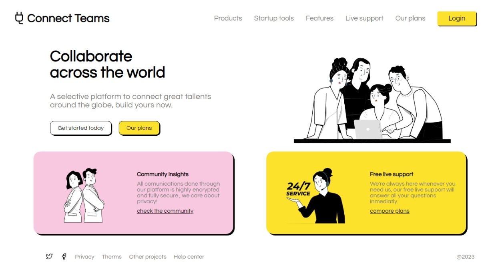

# Práctica Header

### Descripción:
Este proyecto es una práctica que refuerza conocimientos sobre maquetación web con html y css.

**Vista previa del proyecto:**

### Recursos:

-Font en [Google Fonts](https://fonts.google.com/)

-Inspiración de diseño en [Pinterest](https://mx.pinterest.com/)

-Imagenes en [storyset](https://storyset.com/)

-colores en [color hunt](https://colorhunt.co/)

